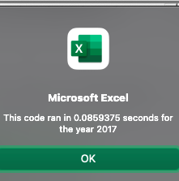
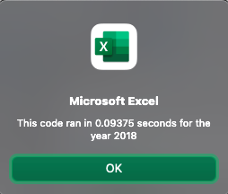
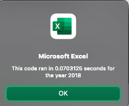

# Stock-analysis

## **Overview of Project**

The purpose of this analysis is show how VBA can help Steve to review the entire stock market and take decisions 

### Purpose

Help Steve to determine the best invertion for his parets, refining the code to run faster 

### Result

We review the code to work faster:

The new code is as follow:

-- 
Sub AllStocksAnalysisRefactored()
    
    Dim startTime As Single
    Dim endTime  As Single

    yearValue = InputBox("What year would you like to run the analysis on?")

    startTime = Timer
    
    'Format the output sheet on All Stocks Analysis worksheet
    Worksheets("All Stocks Analysis").Activate
    
    Range("A1").Value = "All Stocks (" + yearValue + ")"
    
    'Create a header row
    Cells(3, 1).Value = "Ticker"
    Cells(3, 2).Value = "Total Daily Volume"
    Cells(3, 3).Value = "Return"

    'Initialize array of all tickers
    Dim tickers(12) As String
    
    tickers(0) = "AY"
    tickers(1) = "CSIQ"
    tickers(2) = "DQ"
    tickers(3) = "ENPH"
    tickers(4) = "FSLR"
    tickers(5) = "HASI"
    tickers(6) = "JKS"
    tickers(7) = "RUN"
    tickers(8) = "SEDG"
    tickers(9) = "SPWR"
    tickers(10) = "TERP"
    tickers(11) = "VSLR"
    
    'Activate data worksheet
    Worksheets(yearValue).Activate
    
    'Get the number of rows to loop over
    RowCount = Cells(Rows.Count, "A").End(xlUp).Row
    
    '1a) Create a ticker Index
    Dim tickerIndex As Integer
    'tickerIndex at zero.
    tickerIndex = 0
    

    '1b) Create three output arrays
    Dim tickerVolumes(12) As Long
    Dim tickerStartingPrices(12) As Single
    Dim tickerEndingPrices(12) As Single
    
    
    '2a) Create for loop to analyze each ticker in the array.
    For tickerIndex = 0 To 11
    'Initiate each ticker's volume at zero.
    tickerVolumes(tickerIndex) = 0
    
    'Activate data worksheet
    Worksheets(yearValue).Activate
        
    ''2b) Loop over all the rows in the spreadsheet.
        For i = 2 To RowCount
        
            '3a) Increase volume for current ticker
            tickerVolumes(tickerIndex) = tickerVolumes(tickerIndex) + Cells(i, 8).Value
    
        
            '3b) Check if the current row is the first row with the selected tickerIndex.
             'If  Then
                    
            If Cells(i, 1).Value = tickers(tickerIndex) And Cells(i - 1, 1).Value <> tickers(tickerIndex) Then
                'if it is the first row for current ticker, set starting price.
                tickerStartingPrices(tickerIndex) = Cells(i, 6).Value
            
            'End If
            End If
            
            
        '3c) check if the current row is the last row with the selected ticker
        'If the next row’s ticker doesn’t match, increase the tickerIndex.
        'If  Then

            If Cells(i, 1).Value = tickers(tickerIndex) And Cells(i + 1, 1).Value <> tickers(tickerIndex) Then
                tickerEndingPrices(tickerIndex) = Cells(i, 6).Value
            End If
            
            '3d Increase the tickerIndex.
            If Cells(i, 1).Value = tickers(tickerIndex) And Cells(i + 1, 1).Value <> tickers(tickerIndex) Then
                tickerIndex = tickerIndex + 1
            End If
    
        Next i
        
    Next tickerIndex
    
    '4) Loop through your arrays to output the Ticker, Total Daily Volume, and Return.
    
    For i = 0 To 11
        
        Worksheets("All Stocks Analysis").Activate

        Cells(4 + i, 1).Value = tickers(i)
        
        'Sum of Volume
        Cells(4 + i, 2).Value = tickerVolumes(i)
        
        'ReturnValue
        Cells(4 + i, 3).Value = tickerEndingPrices(i) / tickerStartingPrices(i) - 1
        

    
    Next i
    

    'Formatting
    Worksheets("All Stocks Analysis").Activate
    Range("A3:C3").Font.FontStyle = "Bold"
    Range("A3:C3").Borders(xlEdgeBottom).LineStyle = xlContinuous
    Range("B4:B15").NumberFormat = "#,##0"
    Range("C4:C15").NumberFormat = "0.0%"
    Columns("B").AutoFit

    dataRowStart = 4
    dataRowEnd = 15

    For i = dataRowStart To dataRowEnd
        
        If Cells(i, 3) > 0 Then
            
            Cells(i, 3).Interior.Color = vbGreen
            
        Else
        
            Cells(i, 3).Interior.Color = vbRed
            
        End If
        
    Next i
 
    endTime = Timer
    MsgBox "This code ran in " & (endTime - startTime) & " seconds for the year " & (yearValue)

End Sub

### What are the advantages or disadvantages of refactoring code?
The code will be better organized and improved code readability and reduced complexity. A disadvanteage is risky qhen code or application is big 
